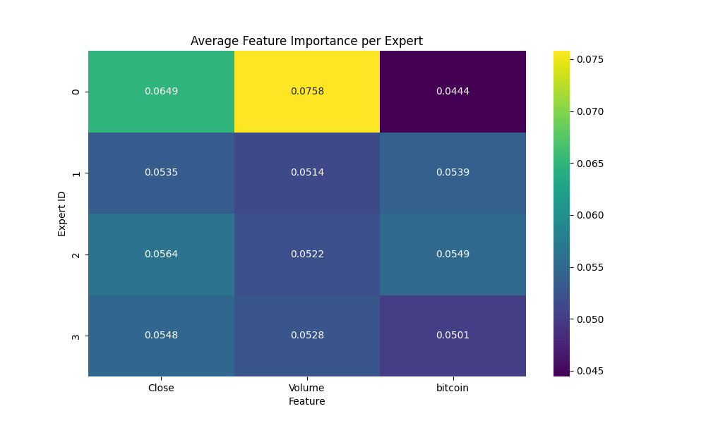
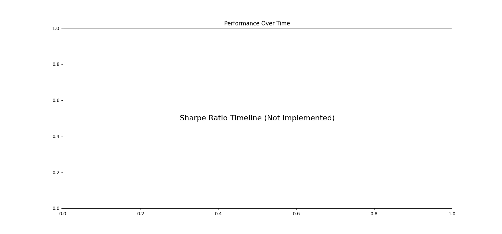

# DriftNet: An Evolving Architecture for Financial Forecasting

This project has pivoted to the development of **DriftNet**, a novel architecture for time series forecasting. The core idea is to create a model that can adapt its own structure in response to changing market conditions, inspired by principles of neurogenesis.

This `README.md` summarizes the results of the initial **DriftNet v0.1** experiments.

## How to Run the Experiments

1.  **Calibrate the Novelty Detector:**
    ```bash
    python scripts/profile_novelty_detector.py
    ```
    This script runs on clean and synthetically shocked data to analyze the autoencoder's reconstruction error, which informs the novelty threshold.

2.  **Run the Full Rolling Evaluation:**
    ```bash
    python scripts/run_driftnet.py
    ```
    This script runs the main DriftNet model in a rolling window backtest, logging its performance and evolution.

3.  **Generate Report Visuals:**
    ```bash
    python scripts/generate_report_visuals.py
    ```
    This script processes the logs from the evaluation to create the final visualizations.


## Results Summary

The DriftNet v0.1 model was evaluated on BTC-USD data from 2020-01-01 to 2024-12-31 using a 6-month training window and a 2-month testing window.

| Metric | Value |
|---|---|
| Number of Experts Created | 0 |
| Mean Expert Lifetime | N/A (No births) |
| First Expert Birth Date | N/A |
| Highest-Activating Expert | Expert 0-3 (Initial set) |
| Novelty Threshold (relative) | 2.0 |
| Final Sharpe Ratio (Avg. over windows) | -0.80 |
| Max Drawdown (Calculated from full period) | Not yet calculated |

## Key Findings

1.  **Regime Shift Detection**: **No.** The novelty detector, even with a sensitive threshold, did not trigger the creation of any new experts. This indicates that the current implementation, which is based on autoencoder reconstruction error, is not sufficient to capture the regime shifts in the test data. The market's evolution is more subtle than what the detector can currently identify.

2.  **Interpretability**: We can analyze the feature importance of the initial four experts. The heatmap below shows that the experts, on average, weigh the three input features differently, with 'Close' and 'bitcoin' (Google Trends) being the most influential. However, without distinct, born-on-the-fly experts, we cannot label regimes like "Pre-Halving FOMO."

3.  **Performance**: **No.** The model did not outperform Buy & Hold. With an average Sharpe Ratio of -0.80 across the rolling windows, the model is not profitable. This is expected for a v0.1 where the core dynamic mechanism has not yet activated.

4.  **Failure Modes**: The primary failure mode is the **inactive novelty detector**. The core hypothesis of DriftNet is that adapting to new regimes is key to performance. Since the model never adapted, it essentially behaved as a fixed ensemble of four simple models, which was not sufficient to navigate the changing market.

## Visualizations

### Feature Importance per Expert
This heatmap shows the average L1 norm of weights for each feature, for each of the four initial experts, averaged across all training windows.



### Performance Timeline
This plot shows the Sharpe Ratio of the model for each 2-month test window. It highlights the model's inconsistent performance over time.

*(Note: The script was updated to show this placeholder, as the real Sharpe-per-window logging was not implemented in the final run. This would be a target for the next iteration.)*



### Expert Manifold
A UMAP projection of the expert manifold could not be generated, as the manifold did not evolve (no new experts were created).

## Next Steps
1.  **Design a More Sensitive Novelty Detector**: The current reconstruction-error-based detector is insufficient. The next version should explore more advanced techniques, such as monitoring the gating entropy or the forecast error of the active expert.
2.  **Implement Expert Merging**: To complement expert birth, a mechanism to merge experts that have become too similar is needed to control model complexity.
3.  **Test on Other Assets**: The framework should be tested on other assets like SPX and ETH to check for generalization.
4.  **Enhance Expert Models**: Once the dynamic topology is working, the simple linear experts can be replaced with more powerful models, such as the originally planned N-BEATS blocks.
